# ARCHITECTURE.md — WhatsApp Atendimento

## 1. Visão Geral

Sistema de atendimento multi-agente via WhatsApp para uso interno corporativo.
Um número de WhatsApp compartilhado por múltiplos atendentes simultaneamente,
com filas por setor, transferências, etiquetas, notas internas e histórico unificado.

---

## 2. Stack e Justificativas

### Backend
| Tecnologia | Versão | Porquê |
|---|---|---|
| Node.js | 20 LTS | Runtime universal, async nativo, excelente ecossistema |
| TypeScript | 5.x (strict) | Segurança de tipos em todo o projeto |
| Fastify | 4.x | 2-3× mais rápido que Express; tipagem nativa; schema validation |
| Prisma | 5.x | ORM com migrations, type safety perfeito, ótimo DX |
| PostgreSQL | 16 | Robusto; SELECT FOR UPDATE para lock otimista; full-text search; JSONB |
| Redis | 7 | Pub/sub para Socket.IO multi-instância; BullMQ queue backing |
| BullMQ | 4.x | Filas de processamento de mensagens; retry, concurrency, delays |
| Socket.IO | 4.x | WebSocket com fallback; Redis adapter para escalar; rooms/namespaces |
| Baileys | latest | Biblioteca WhatsApp Web não-oficial; mantida ativamente |
| MinIO | latest | S3-compatible local; substitui por AWS S3 mudando apenas env vars |
| Pino | 8.x | Logging estruturado JSON; extremamente rápido |
| Zod | 3.x | Validação de schema em runtime com inferência TypeScript |

### Frontend
| Tecnologia | Versão | Porquê |
|---|---|---|
| React | 18 | Padrão de mercado; concurrent features; hooks |
| Vite | 5.x | Build ultrarrápido; HMR instantâneo |
| TypeScript | 5.x | Compartilha tipos com backend via workspace |
| Tailwind CSS | 3.x | Utility-first; sem CSS em arquivo separado |
| shadcn/ui | latest | Componentes acessíveis, customizáveis, sem runtime |
| TanStack Query | 5.x | Gerenciamento de server state; cache; optimistic updates |
| Zustand | 4.x | State management leve para UI state (layout, modais, etc.) |
| Socket.IO client | 4.x | Conexão com backend real-time |
| React Router | 6.x | Roteamento SPA |

### Monorepo
```
pnpm workspaces
├── apps/api      → backend Fastify
├── apps/web      → frontend React
└── packages/shared → tipos compartilhados (DTOs, enums)
```

---

## 3. Abstração do Canal WhatsApp

### Princípio
**Nenhum arquivo fora de `apps/api/src/providers/BaileysProvider.ts`
pode importar Baileys diretamente.** Toda comunicação passa pela interface.

### Interface
```typescript
// packages/shared/src/types/provider.ts
export type ConnectionStatus = 'disconnected' | 'connecting' | 'qr_ready' | 'connected';

export interface MessageResult { id: string }

export interface InboundMessage {
  whatsappMessageId: string;
  from: string;               // telefone do remetente
  type: MessageType;
  content: MessageContent;
  timestamp: Date;
  quotedMessageId?: string;
}

export interface WhatsAppProvider {
  connect(): Promise<void>;
  disconnect(): Promise<void>;
  getStatus(): ConnectionStatus;

  sendText(to: string, text: string, quotedId?: string): Promise<MessageResult>;
  sendMedia(to: string, payload: OutboundMediaPayload): Promise<MessageResult>;
  downloadMedia(message: InboundMessage): Promise<NodeJS.ReadableStream>;

  onMessage(handler: (msg: InboundMessage) => Promise<void>): void;
  onStatusChange(handler: (status: ConnectionStatus) => void): void;
  onQRCode(handler: (qr: string) => void): void;
  onMessageStatusUpdate(handler: (update: MessageStatusUpdate) => void): void;
}
```

### Implementações
- **`BaileysProvider.ts`** → MVP (usa protocolo WhatsApp Web)
- **`MetaCloudProvider.ts`** → v2 (usa Cloud API oficial da Meta)

Para migrar: apenas trocar qual implementação é injetada no container de DI.
**Zero mudança nas camadas de negócio.**

### Sessão Criptografada
```
Baileys session → JSON → AES-256-GCM encrypt → base64 → PostgreSQL (tabela whatsapp_sessions)
                          ↑ SESSION_ENCRYPTION_KEY no env
```

---

## 4. Modelo de Dados

```mermaid
erDiagram
    users {
        uuid id PK
        string name
        string email UK
        string password_hash
        enum role "admin|supervisor|attendant"
        string avatar_url
        bool is_active
        timestamp created_at
        timestamp updated_at
    }

    departments {
        uuid id PK
        string name UK
        string description
        string color
        timestamp created_at
        timestamp updated_at
    }

    user_departments {
        uuid user_id FK
        uuid department_id FK
        enum role "supervisor|attendant"
        timestamp created_at
    }

    contacts {
        uuid id PK
        string phone UK
        string name
        string avatar_url
        text notes
        bool is_blocked
        timestamp created_at
        timestamp updated_at
    }

    labels {
        uuid id PK
        string name UK
        string color
        timestamp created_at
    }

    contact_labels {
        uuid contact_id FK
        uuid label_id FK
    }

    conversations {
        uuid id PK
        uuid contact_id FK
        uuid department_id FK
        uuid assigned_user_id FK
        enum status "pending|open|resolved"
        int version "optimistic lock"
        timestamp created_at
        timestamp updated_at
        timestamp resolved_at
        timestamp last_message_at
    }

    conversation_labels {
        uuid conversation_id FK
        uuid label_id FK
    }

    messages {
        uuid id PK
        uuid conversation_id FK
        string whatsapp_message_id UK "idempotency"
        enum direction "inbound|outbound"
        enum type "text|image|audio|video|document|sticker|location"
        jsonb content
        enum status "pending|sent|delivered|read|failed"
        bool is_internal_note
        uuid sender_user_id FK
        uuid quoted_message_id FK
        string media_key
        timestamp created_at
    }

    conversation_events {
        uuid id PK
        uuid conversation_id FK
        uuid user_id FK
        enum type "assigned|transferred|resolved|reopened|note"
        jsonb data
        timestamp created_at
    }

    quick_replies {
        uuid id PK
        string trigger UK
        text content
        uuid department_id FK
        timestamp created_at
        timestamp updated_at
    }

    whatsapp_sessions {
        uuid id PK
        string provider
        text session_data "AES-256-GCM encrypted"
        enum status "disconnected|connecting|connected"
        timestamp created_at
        timestamp updated_at
    }
```



### Índices Críticos
```sql
-- Busca de conversas por contato
CREATE INDEX idx_conversations_contact ON conversations(contact_id);
-- Fila pendente por setor
CREATE INDEX idx_conversations_dept_status ON conversations(department_id, status);
-- Mensagens paginadas
CREATE INDEX idx_messages_conversation ON messages(conversation_id, created_at DESC);
-- Busca full-text em mensagens
CREATE INDEX idx_messages_fts ON messages USING GIN(to_tsvector('portuguese', content->>'text'));
-- Idempotência
CREATE UNIQUE INDEX uidx_messages_wa_id ON messages(whatsapp_message_id) WHERE whatsapp_message_id IS NOT NULL;
```

---

## 5. Estrutura de Pastas

```
whatsapp-atendimento/
├── docker-compose.yml
├── docker-compose.override.yml   # dev overrides (volumes, ports)
├── .env                          # valores de dev (git-ignored)
├── .env.example
├── package.json                  # pnpm workspace root
├── pnpm-workspace.yaml
├── turbo.json                    # opcional: Turborepo para builds incrementais
├── ARCHITECTURE.md
├── CLAUDE.md
├── README.md
│
├── packages/
│   └── shared/
│       ├── package.json
│       └── src/
│           ├── types/
│           │   ├── provider.ts         # WhatsAppProvider interface
│           │   ├── conversation.ts     # DTOs de conversa
│           │   ├── message.ts          # DTOs de mensagem
│           │   └── user.ts             # DTOs de usuário
│           └── index.ts
│
└── apps/
    ├── api/
    │   ├── package.json
    │   ├── tsconfig.json
    │   ├── prisma/
    │   │   ├── schema.prisma
    │   │   ├── migrations/
    │   │   └── seed.ts
    │   └── src/
    │       ├── main.ts               # Entry point
    │       ├── app.ts                # Fastify app factory
    │       ├── config.ts             # Zod env validation
    │       ├── providers/
    │       │   ├── WhatsAppProvider.ts   # Interface + factory
    │       │   └── BaileysProvider.ts    # ÚNICA importação de Baileys
    │       ├── plugins/
    │       │   ├── prisma.ts         # Fastify plugin Prisma
    │       │   ├── redis.ts          # Fastify plugin Redis
    │       │   ├── socket.ts         # Socket.IO setup
    │       │   ├── auth.ts           # JWT plugin
    │       │   └── minio.ts          # MinIO client plugin
    │       ├── modules/
    │       │   ├── auth/
    │       │   │   ├── auth.routes.ts
    │       │   │   ├── auth.service.ts
    │       │   │   └── auth.schema.ts
    │       │   ├── users/
    │       │   ├── departments/
    │       │   ├── contacts/
    │       │   ├── conversations/
    │       │   │   ├── conversations.routes.ts
    │       │   │   ├── conversations.service.ts  # lock otimista aqui
    │       │   │   └── conversations.schema.ts
    │       │   ├── messages/
    │       │   │   ├── messages.routes.ts
    │       │   │   ├── messages.service.ts       # idempotência aqui
    │       │   │   └── ingest.worker.ts          # BullMQ worker
    │       │   ├── labels/
    │       │   ├── quick-replies/
    │       │   └── admin/
    │       │       └── whatsapp.routes.ts        # QR code, status
    │       └── lib/
    │           ├── crypto.ts         # AES-256-GCM para sessão
    │           ├── queue.ts          # BullMQ setup
    │           ├── pubsub.ts         # Redis pub/sub helpers
    │           └── logger.ts         # Pino instance
    │
    └── web/
        ├── package.json
        ├── tsconfig.json
        ├── vite.config.ts
        ├── index.html
        └── src/
            ├── main.tsx
            ├── App.tsx
            ├── router.tsx
            ├── lib/
            │   ├── api.ts            # Axios instance
            │   ├── socket.ts         # Socket.IO client
            │   └── queryClient.ts    # TanStack Query config
            ├── store/
            │   └── ui.store.ts       # Zustand (layout, modais)
            ├── hooks/
            │   ├── useAuth.ts
            │   ├── useSocket.ts
            │   └── useConversations.ts
            ├── components/
            │   ├── ui/               # shadcn/ui components
            │   ├── layout/           # AppShell, Sidebar, etc.
            │   ├── conversations/    # ConversationList, ConversationView
            │   ├── messages/         # MessageBubble, MessageInput
            │   └── admin/            # Telas de configuração
            └── pages/
                ├── LoginPage.tsx
                ├── ChatPage.tsx
                └── admin/
```

---

## 6. Fluxo de Mensagem Recebida

```
WhatsApp → Baileys → BaileysProvider.onMessage()
                          ↓
                   BullMQ Queue "ingest"
                          ↓
                   IngestWorker (1 concorrência p/ evitar duplicatas)
                          ↓
              INSERT INTO messages ON CONFLICT DO NOTHING
              (idempotência via whatsapp_message_id único)
                          ↓
              Atualiza conversation (status, last_message_at)
                          ↓
              Redis PUBLISH "conversation:updated"
                          ↓
              Socket.IO emite para rooms corretas
```

---

## 7. Corrida de Atribuição (Lock Otimista)

```sql
-- Transação de atribuição
BEGIN;
  SELECT id, version, assigned_user_id, status
  FROM conversations
  WHERE id = $conversationId
  FOR UPDATE;               -- bloqueia a linha

  -- Se já atribuída ou versão mudou → lança erro 409
  UPDATE conversations
  SET assigned_user_id = $userId,
      status = 'open',
      version = version + 1
  WHERE id = $conversationId
    AND version = $expectedVersion
    AND status = 'pending';

  -- Se 0 linhas afetadas → 409 Conflict (alguém ganhou na frente)
COMMIT;
```

---

## 8. Real-time com Socket.IO

```
Socket.IO Server + Redis Adapter (ioredis)
         ↓
Rooms:
  "user:{userId}"         → eventos pessoais do atendente
  "dept:{deptId}"         → fila do setor
  "conv:{convId}"         → atualização dentro da conversa

Eventos emitidos pelo servidor:
  "conversation:new"       → nova conversa entra na fila
  "conversation:assigned"  → sai da fila (dono escolhido)
  "conversation:resolved"  → conversa encerrada
  "conversation:reopened"  → reabertura
  "message:new"            → mensagem nova na conversa
  "message:status"         → atualização de entregue/lido
  "whatsapp:status"        → conexão QR/conectado/desconectado
```

---

## 9. Roadmap de Implementação

| Fase | O que será entregue | Validação |
|---|---|---|
| 0 | Monorepo, Docker compose, env, CLAUDE.md | `docker compose up` sem erros |
| 1 | Prisma schema, migrations, seed básico | `pnpm db:migrate`, studio abre |
| 2 | Auth API (login/refresh/me), users CRUD | testes unitários auth, build ok |
| 3 | Departments, Labels, Contacts, Quick Replies APIs | typecheck ok |
| 4 | WhatsAppProvider interface + BaileysProvider | testes contrato provider |
| 5 | Message ingest (BullMQ worker, idempotência) | teste idempotência |
| 6 | Conversations API (create, list, assign com lock) | teste race condition |
| 7 | Media upload/download via MinIO (streaming) | upload/download funcional |
| 8 | Socket.IO real-time (eventos) | eventos chegam no cliente |
| 9 | Frontend completo (todas as telas) | app funcional no browser |
| 10 | Testes obrigatórios completos + README | `pnpm test` passa |

---

## 10. Decisões de Segurança

- Senhas: **bcrypt** (cost 12)
- JWT: access token 15min + refresh token 7d (httpOnly cookie)
- Sessão Baileys: **AES-256-GCM** com IV aleatório por encryção
- Env vars: validadas com Zod no startup (app não sobe se faltarem)
- CORS: whitelist da origin do frontend apenas
- Rate limiting: Fastify rate-limit nas rotas de auth

---

## 11. Variáveis de Ambiente

```env
# PostgreSQL
DATABASE_URL=postgresql://wa:wa@localhost:5432/wa_atendimento

# Redis
REDIS_URL=redis://localhost:6379

# MinIO
MINIO_ENDPOINT=localhost
MINIO_PORT=9000
MINIO_ACCESS_KEY=minioadmin
MINIO_SECRET_KEY=minioadmin
MINIO_BUCKET=whatsapp-media
MINIO_USE_SSL=false

# Auth
JWT_SECRET=<32+ chars>
JWT_REFRESH_SECRET=<32+ chars>

# Sessão WhatsApp
SESSION_ENCRYPTION_KEY=<32 bytes hex>

# App
PORT=3000
NODE_ENV=development
FRONTEND_URL=http://localhost:5173
LOG_LEVEL=debug
```
